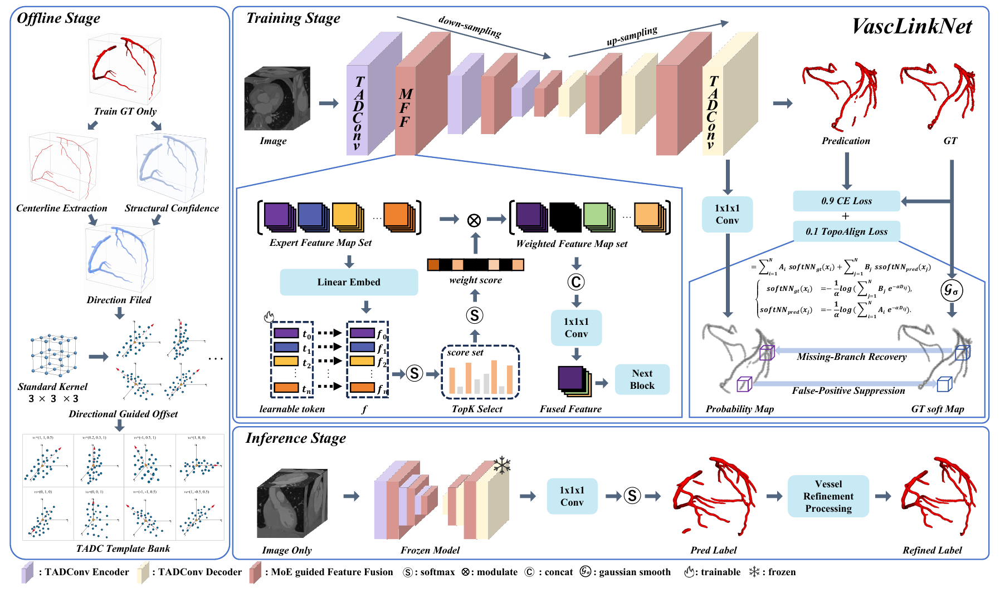
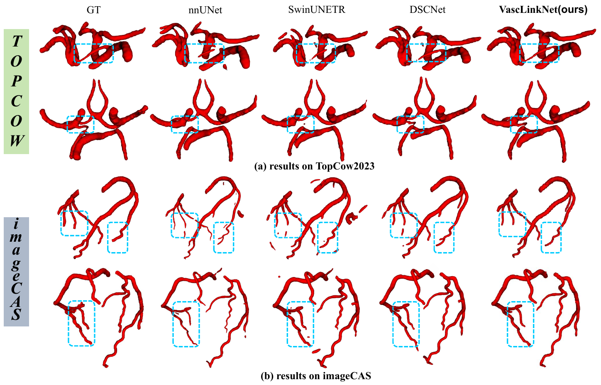
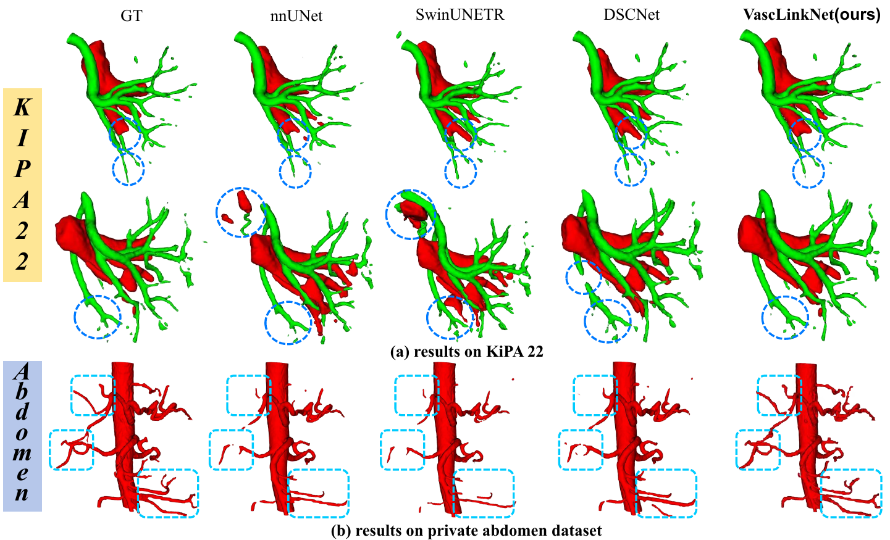
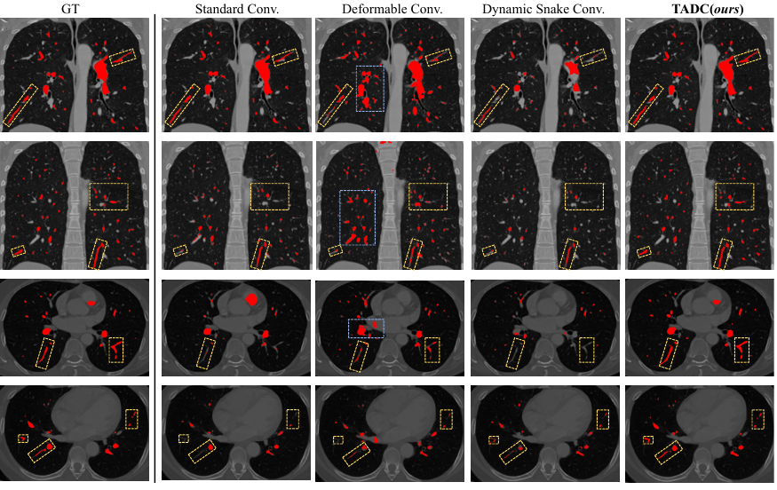
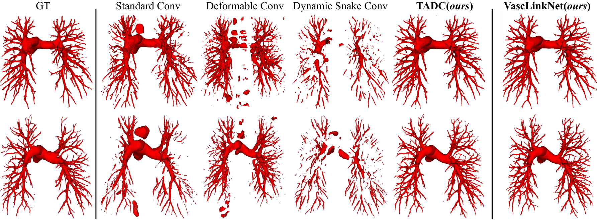
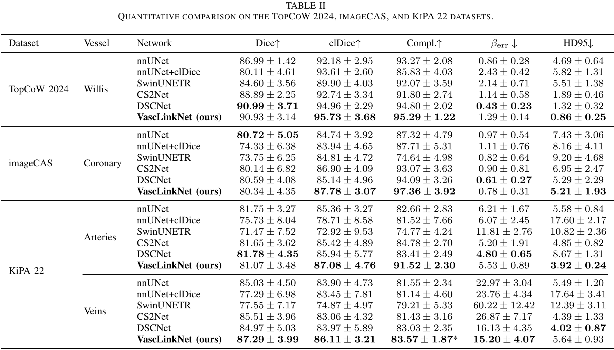
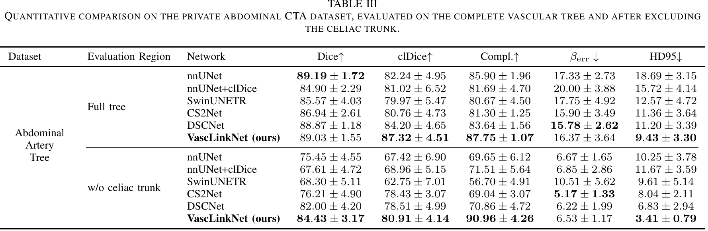
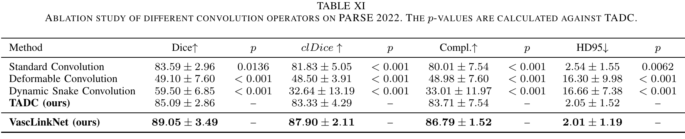

# VascLinkNet

### Explicit Tubular Structure Modeling with Topological Learning Constraints for 3D Vessel Segmentation in Medical Images

VascLinkNet is a structure-guided framework for 3D vessel segmentation. It is designed to preserve vascular connectivity and topological consistency under challenging conditions, including tortuous geometry, thin branches, complex bifurcations, imaging noise, and highly imbalanced foreground distributions.

The framework combines explicit direction-aware vessel modeling, adaptive feature fusion, topology-aligned supervision, and structure-aware refinement. Experiments on cerebral, coronary, renal, abdominal, and pulmonary vascular datasets demonstrate strong connectivity preservation while maintaining competitive voxel-overlap accuracy and spatial consistency.

## Highlights

- **Topology-Aware Directional Convolution (TADC):** uses vessel-aligned sampling templates derived from training annotations to capture direction-aware structural features.
- **Mixture-of-Experts-guided Feature Fusion (MFF):** adaptively selects and fuses responses from multiple directional template branches.
- **TopoAlign loss:** performs differentiable bidirectional geometric matching in the continuous domain to improve structural continuity.
- **Vessel Refinement Processing (VRP):** repairs residual disconnections, recovers missing branches, and suppresses false-positive structures during post-processing.
- **Extensive evaluation:** covers TopCoW 2024, imageCAS, KiPA 22, an in-house abdominal CTA dataset, and PARSE 2022.

## Framework

The complete pipeline contains three stages: offline template construction, network training, and inference. The offline stage builds a TADC template bank from vessel centerlines, direction fields, and structural confidence. During training, TADC and MFF provide structure-aware representations, while CE and TopoAlign jointly supervise regional accuracy and vascular continuity. During inference, the frozen model produces the segmentation prediction, which is further refined by VRP.

*Figure 2. Overview of the proposed VascLinkNet framework for structure-guided 3D vessel segmentation.*

## Qualitative Results

### Cerebral and coronary arteries

On TopCoW 2024, VascLinkNet preserves extremely thin branches while maintaining accurate vascular morphology. On imageCAS, it produces stable coronary artery reconstructions in regions affected by complex anatomy and imaging noise.

*Figure 4. Qualitative comparison on the TopCoW 2024 and imageCAS datasets. Blue dashed boxes highlight challenging thin branches and noise-affected regions.*

### Renal and abdominal vessels

The KiPA 22 cases contain intertwined arteries and veins as well as tumor-induced vascular deformation. The abdominal CTA cases additionally present a pronounced long-tailed distribution in which the celiac trunk dominates the foreground voxels. VascLinkNet maintains fine-branch continuity and reduces structural disconnections in both settings.

*Figure 5. Qualitative comparison on KiPA 22 and the in-house abdominal CTA dataset.*

### Convolution-operator analysis

The comparison on PARSE 2022 highlights the effect of different convolutional sampling strategies. Standard and Dynamic Snake convolutions produce unstable predictions in thin peripheral branches, while unconstrained deformable sampling introduces false positives from nearby anatomical structures. TADC better preserves distal pulmonary vessels with fewer false-positive responses.

*Figure 7. Slice-level pulmonary artery segmentation results produced by different convolutional operators.*

The complete VascLinkNet further improves the continuity and structural integrity of pulmonary artery trees beyond the standalone TADC configuration.

*Figure 8. Qualitative pulmonary artery segmentation comparison on PARSE 2022.*

## Quantitative Results

The reported metrics include Dice for voxel overlap, clDice and Completeness for vascular connectivity, Betti error for topology, and HD95 for spatial boundary error. Higher values are better for Dice, clDice, and Completeness; lower values are better for Betti error and HD95.

### Public datasets

Across TopCoW 2024, imageCAS, and KiPA 22, VascLinkNet consistently achieves the strongest clDice and Completeness results, demonstrating its advantage in preserving connected vascular structures across different anatomical regions.

*Table II. Quantitative comparison on TopCoW 2024, imageCAS, and KiPA 22.*

### Abdominal CTA dataset

Evaluation is performed on both the complete abdominal arterial tree and the region excluding the celiac trunk. The latter setting emphasizes medium and small branches under a highly imbalanced vascular distribution. VascLinkNet obtains the best Dice, clDice, Completeness, and HD95 in this challenging region.

*Table III. Quantitative comparison on the in-house abdominal CTA dataset.*

### Ablation of convolution operators

On PARSE 2022, TADC outperforms standard, deformable, and Dynamic Snake convolutions in vessel overlap, connectivity, completeness, and HD95. Integrating TADC into the complete VascLinkNet framework provides a further improvement across all reported metrics.

*Table XI. Ablation study of different convolution operators on PARSE 2022.*

## Summary

VascLinkNet explicitly models vascular geometry and connectivity instead of relying solely on voxel-level supervision. The results show that combining direction-aware sampling, adaptive expert fusion, topology-aligned learning, and structural refinement provides a robust solution for complex 3D vessel segmentation across multiple anatomical regions and imaging conditions.
